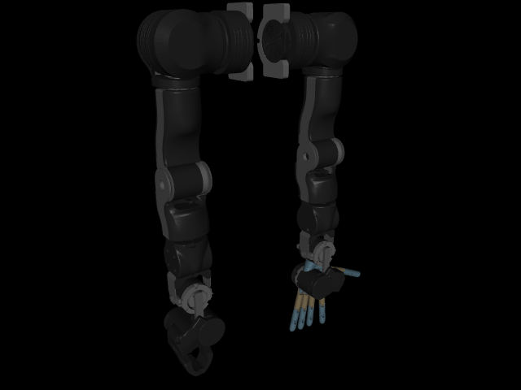
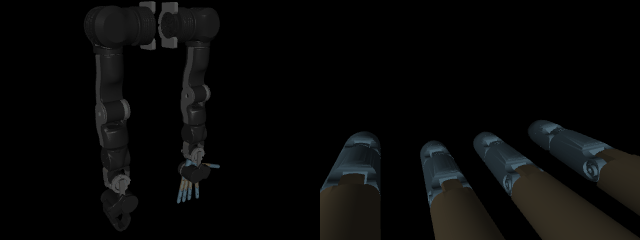
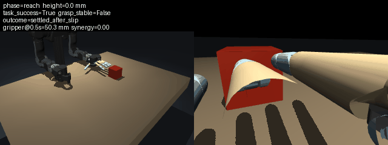

# OpenArm + Wuji Learning

Pre-hardware integration project for OpenArm MuJoCo, Wuji retargeting, data collection,
ACT, and a fail-safe asynchronous policy bridge.

## Current status

- Project interfaces, mock backend, hand synergies, action validation, and tests: ready.
- Official repositories are pinned in `docs/upstream_versions.md`.
- OpenArm v2 headless smoke: passed on native Windows with MuJoCo 3.12.0; `outputs/openarm/` is generated locally.
- Wuji Hand full prerecorded retargeting: passed under WSL2 Ubuntu 22.04; 2751 frames of 21×3 keypoints converted to finite 20-D trajectories.
- Combined OpenArm v2 + left Wuji Hand model: compiled and stable; 20-DoF hand synergies are config-driven and safety limited.
- Reach–Grasp–Lift scene: deterministic reset, fixed dual cameras, 6D palm-pose IK, contact-aware power grasp, and SE(3)-evaluated Lift are ready for diagnostics. Schema-v3 episodes add palm/object velocities, cube-frame contact faces/edges, opposition, and net wrench telemetry while preserving the LeRobot policy contract. The first five fixed seeds still contain zero strict stable grasps, so ACT training remains deferred.
- Stage-1 grasp RL: expert-derived PCA5 absolute actions solve the original 20-D/manual5D exploration bottleneck and reach 3–4 simultaneous contacts. Reward V3 preserves multi-contact but does not improve edge margin/slip or 0.3 s hold. A no-training reachability audit then evaluates 2500 global, 720 local, and 50 full-hold PCA5 candidates: none reaches formal success or 0.3 s persistent low-slip contact. The evidence points first to fixed-palm geometry/rigid-domain mismatch and second to insufficient independent correction inside PCA5; the next controlled test is a small bounded palm SE(3) residual search, not longer RL.
- Real robot protocol: intentionally unimplemented until the customized arm specification arrives.



## Upstream model setup

Local upstream checkouts are intentionally excluded from Git. Clone and pin them
before building the combined model:

```powershell
git clone https://github.com/enactic/openarm_mujoco.git vendor/openarm_mujoco
git -C vendor/openarm_mujoco checkout a8c979629f2591ad035d99d338ce114969e6cddc
git clone --recursive https://github.com/wuji-technology/wuji-retargeting.git vendor/wuji-retargeting
git -C vendor/wuji-retargeting checkout 531f6ed4250b475d2e9231f54e988fc9b1c5b4ea
```

OpenArm MuJoCo is Apache-2.0 licensed. Wuji retargeting and its hand description
are MIT licensed; their copyright and license files remain in the upstream checkouts.

Run the dependency-free smoke test from PowerShell:

```powershell
./scripts/smoke_mock.ps1
./scripts/run_openarm_headless.ps1
./scripts/run_wuji_retarget_wsl.ps1 -WslPython /path/to/wuji-retarget/bin/python -WujiSource /path/to/wuji-retargeting
./scripts/run_combined_smoke.ps1
./scripts/run_combined_control_smoke.ps1
./scripts/setup_lerobot_policy.ps1
./scripts/run_lerobot_contract_smoke.ps1
./scripts/run_reach_only_smoke.ps1
./scripts/run_grasp_smoke.ps1
./scripts/run_lift_smoke.ps1
./scripts/run_episode_recording_smoke.ps1
./scripts/run_grasp_settle_experiment.ps1
# GUI (interactive; close the MuJoCo window to exit)
./scripts/run_openarm_gui.ps1
```

See `docs/environment_report.md`, `docs/setup_decisions.md`, and `docs/known_gaps.md`.
The evidence-backed status audit and next seven days are in `docs/status_and_7_day_plan.md`.

The combined-control smoke exposes one stable policy action vector: 7 left-arm joint
targets followed by three hand synergies (`open_close`, `pinch`, `spread`). It drives
both subsystems in the same MuJoCo step loop. Each observation contains front and wrist
RGB (`uint8`, HWC), arm and hand positions/velocities, the 20-D bounded hand target, the
3-D synergy command, the actual bounded 10-D policy action, contiguous frame index,
high-resolution host timestamp, and simulation timestamp. The smoke writes a 90-frame
episode to `outputs/combined/combined_control_recording.npz`, replays it from a clean
reset, and rejects state error above `1e-4`.



## LeRobot plugin contract

The installable package `lerobot_robot_openarm_wuji` registers
`openarm_wuji_follower` without modifying LeRobot. The policy-visible contract is two
same-size RGB cameras, 27-D measured position state, and a 10-D action consisting of
seven arm targets plus three hand synergies. Backend timestamps and diagnostic fields
are deliberately excluded from the first ACT input. See `docs/lerobot_integration.md`.

## Reach–Grasp–Lift task

`run_lift_smoke.ps1` rebuilds a task model from the pinned official assets, resets a
free cube with an explicit seed, executes collision-free Reach, closes the power grasp,
preloads with fixed arm targets, checks a fresh SE(3)/wrench window, and follows a
bounded quintic Cartesian Lift reference at constant hand synergy. `task_success` requires
80 mm cube elevation for 15 consecutive frames, while `grasp_stable` separately checks
object-in-palm SE(3) drift against explicitly labeled CD-WM external baselines. The episode smoke records all six
phases as `observation_t -> bounded action_t -> observation_t+1` and replays the saved
actions from the same seeded reset. This intermediate NPZ is not yet an ACT training
dataset. See `docs/reach_grasp_lift.md` and `docs/episode_recording.md`.



The preload/S-curve experiment, actual trajectory tracking limits, and seed-7 slip diagnosis are documented in
`docs/grasp_settle_experiment.md` and `docs/grasp_geometry_diagnostics.md`.

## Stage-1 grasp RL

This first RL baseline learns only static contact acquisition with the arm numerically
fixed. It intentionally excludes RGB, ACT, Lift, torque control, domain randomization,
and hard-coded face topology. Run the environment checker/random-policy smoke and a
short SAC update with:

```powershell
./.venvs/lerobot-policy/Scripts/python.exe scripts/rl_grasp_smoke.py
./.venvs/lerobot-policy/Scripts/python.exe scripts/train_sac_grasp.py --timesteps 256
```

The environment contract, reward equation, reset, provisional success gate, and first
short-run evidence are in `docs/rl_grasp_stage1.md`.

The controlled Reward V2 action-space ablation is also complete. A 5-D per-finger
structured action exactly reproduces the old scripted closing direction when all five
commands are +1, and its sanity probe reaches five simultaneous contacts. A fresh 5K
SAC run nevertheless remains at one maximum training contact, so it is not extended
to 10K. See `docs/structured_action_ablation_5k.md`.

Real Wuji cube teleoperation has now been downloaded from
`yeeeiii111/wuji-pick-and-place` at a pinned revision and analyzed across all 60
left/right cube episodes directly from the 54-D LeRobot state/action Parquet arrays.
The hand-only export contains 20,769 bit-exact frames. Centered PCA needs 5 side-specific
dimensions for about 95% of state/action closing-delta variance; finger onset is often
staged and the thumb direction is strongly side-specific. See
`docs/wuji_cube_teleop_analysis.md`.

The subsequent expert-PCA5 prior, contact-topology diagnosis, and Reward V3
contact-quality 5K ablation are documented in
`docs/expert_pca5_action_prior.md`, `docs/contact_topology_stability_diagnosis.md`,
and `docs/reward_v3_contact_quality_5k.md`. The V3 experiment keeps the original
policy contract, records quality only as telemetry, and follows its stop rule: no
10K run after edge margin and tangential slip failed to improve. The subsequent
no-training latent reachability search is in
`docs/pca5_fixed_palm_reachability_analysis.md`.

## License

This project is licensed under the Apache License 2.0. See [LICENSE](LICENSE).
Third-party components retain their respective upstream licenses.
