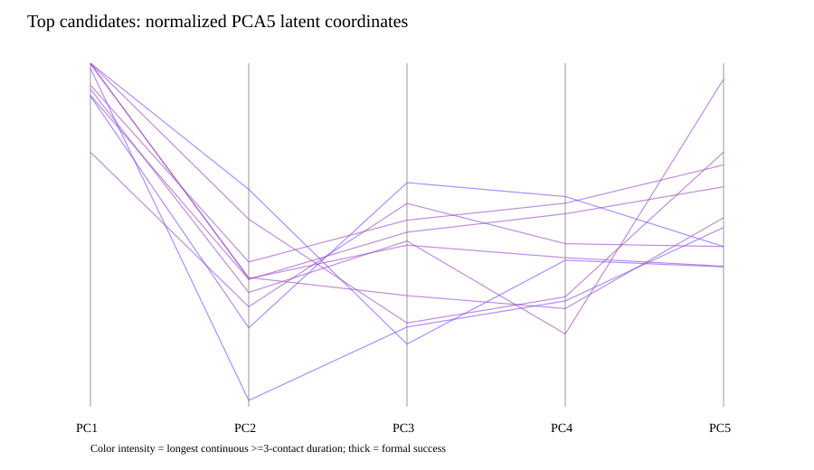
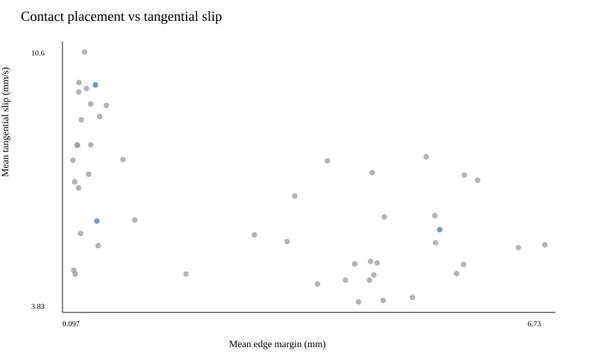
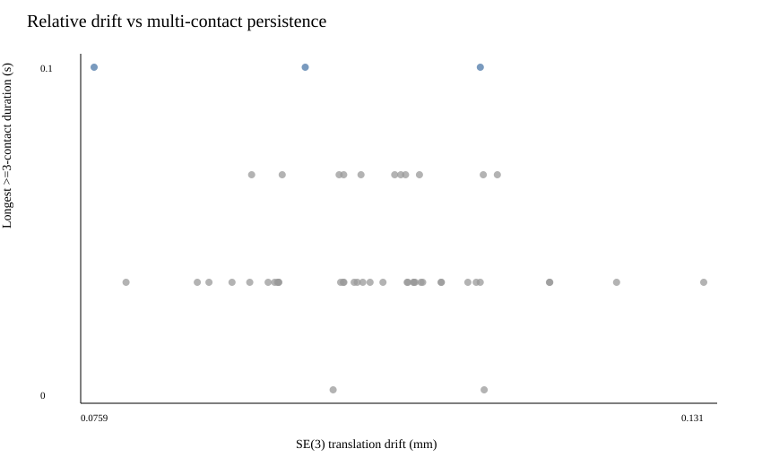
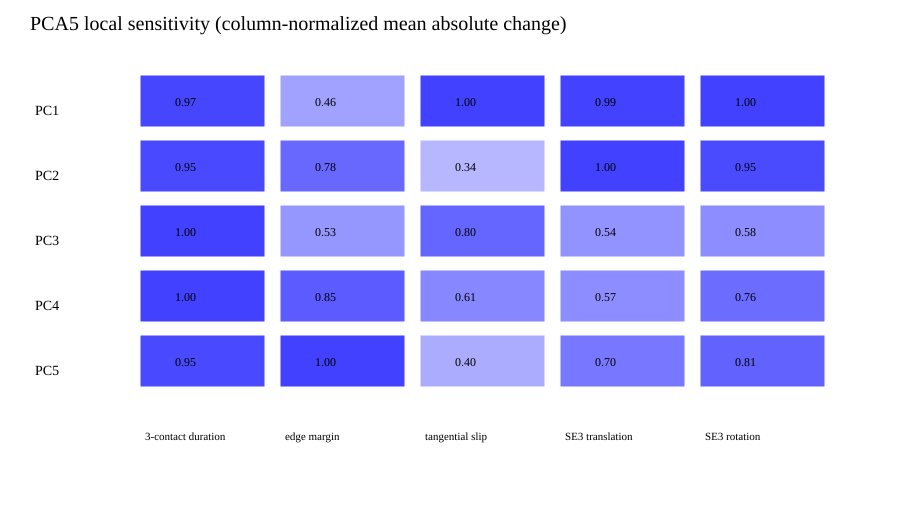

# PCA5 fixed-palm rigid-cube reachability analysis

## 结论

本轮没有加载或训练任何 SAC/PPO/BC policy，也没有修改 reward、success gate、PCA basis、latent scaling、fixed-palm pose、rigid-cube contact、PD、rate limit、joint limit 或 observation。

在当前可用域 `z in [-1,1]^5` 内，经过 2500 个 Latin-hypercube 全局候选、720 个局部 refinement 候选和 50 个完整 terminal-hold 候选后，**没有找到 mechanically stable grasp posture**：

- formal `stable_grasp_success`: `0/50`；
- Level 2 (`>=2` contacts 0.30 s、低 contact slip、无 penetration exploit): `0/50`；
- Level 1 (`>=3` contacts 0.10 s): `3/50`，且都只刚好达到 0.10 s；
- full candidate 中最长 `>=2` contact 为 `0.267 s`，最长 `>=3` contact 为 `0.100 s`。

这是有限 deterministic search 的经验结论，不是对连续 5D 空间的数学不存在性证明。但在本轮约定的 Case C 判据下，证据足以支持：

> Current PCA5 + fixed-palm geometry likely does not contain a stable rigid-cube grasp solution within the policy-visible latent scaling.

因此不应继续 Reward V4、SAC 10K 或 50K。

## 搜索协议

每个候选严格使用当前映射：

```text
normalized z in [-1,1]^5
physical latent = latent_center + latent_half_range * z
q_target = clip(mu + B @ physical_latent, joint_limits)
```

候选从同一个 Stage1 seed-7 reset 开始。请求的 `q_target` 在整个 rollout 内保持不变，通过现有 joint-rate limit、PD 和 fixed arm 执行，没有 SAC 或其他闭环 latent update。

搜索分为：

1. 2500 个 seed-7 Latin-hypercube candidate，每个 0.5 s quick screen；
2. quick-screen 中优先按 stability level、3/2-contact duration、contact count 排序，选择 top 30；
3. 每个 local seed 在 `sigma=0.20/0.10/0.05` 下各做 8 次 bounded perturbation，共 720 candidate；
4. 对合并后的 top 50 执行最多 2 s constant-target rollout，并使用最后完整 1 s terminal window；
5. 最终 top 3 做每个 PC `+/-0.05`、`+/-0.10` sensitivity；
6. 最佳固定 z 在 seeds 7–11 验证，不允许逐 seed 重新优化。

50 个 full candidate 都因刚性接触负载而没有让 rate-limited applied target 与请求 `q_target` 数值完全相等。它们仍持续接收同一个 absolute target 两秒；因此使用最后完整一秒评估，而不是把“未精确到达”错误当成零 hold。

## Diagnostic objective

搜索 objective 只用于排序，不是 Reward V3，也不覆盖 formal success：

```text
J = 2 Q_contact
  + 2 Q_persistence
  + 1 Q_interior
  - 1 P_contact_slip
  - 1 P_SE3_drift
  - 0.5 P_cube_motion
  - 2 P_penetration
  + 3 I_formal_success
```

所有原始 contact、duration、edge、slip、SE(3)、cube motion 和 penetration 指标均单独保存。Candidate selection 先比较物理 stability level，再比较 scalar objective，避免 no-contact candidate 通过低 slip 刷到 multi-contact candidate 前面。

## 全局与局部搜索覆盖

| Stage | 候选数 | 0 contact max | 1 contact max | 2 contact max | 3 contact max | quick Level 1+ |
|---|---:|---:|---:|---:|---:|---:|
| Global LHS | 2500 | 1584 | 665 | 231 | 20 | 0 |
| Local refinement | 720 | 16 | 268 | 363 | 73 | 0 |

Local search 明显提高了 multi-contact candidate 的密度，但 quick 0.5 s window 内仍没有三指保持 0.10 s。完整一秒 terminal evaluation 的 top 50 中，35 个达到 3 contacts、13 个达到 4 contacts，却仍然只有 3 个 Level 1，说明“能碰到”与“能保持”之间存在明显断层。

## 最好候选

没有 formal stable z。按照 stability level 优先的排序，最佳 near-stable candidate 为：

```text
normalized z = [
   0.97066095,
  -0.96323160,
  -0.53568207,
  -0.38360130,
   0.04389234
]

physical latent = [
   1.35437340,
  -1.11683508,
  -0.78451782,
  -0.35500376,
   0.15894749
]
```

按 `finger1..finger5`、每指 `joint1..joint4` 的 20D target（rad）：

```text
Finger1 [1.603000, 0.025748, 0.165796, 0.000000]
Finger2 [0.783322, 0.189991, 0.816538, 0.295171]
Finger3 [1.011887, 0.225255, 0.342736, 0.954782]
Finger4 [1.076294, 0.198272, 0.868353, 0.520851]
Finger5 [0.452340, 0.370000, 1.218303, 0.464178]
```

其中 2 个 joint target 被现有 joint limit 裁剪。结果：

| 指标 | 数值 |
|---|---:|
| max contacts after settle | 3 |
| longest `>=2` contacts | 0.167 s |
| longest `>=3` contacts | 0.100 s |
| mean edge margin | 0.434 mm |
| min edge margin | approximately 0 mm |
| mean tangential slip | 6.021 mm/s |
| relative translation drift | 0.111 mm |
| relative rotation drift | 0.116 deg |
| cube displacement | 0.232 mm |
| cube rotation | 0.217 deg |
| deepest penetration | 0.350 mm |
| penetration exploit | false |
| formal success | false |

它接触 finger1–finger4，但 finger1/2/3 主要是 edge contact；finger4 在 edge/corner/interior 之间切换。finger5 没有接触。低 slip 和低 SE(3) drift 并没有变成持续 topology。

## 为什么 formal success 失败

在 50 个 full candidate 的最后 formal window 中：

| Formal 条件 | 通过数 |
|---|---:|
| full sustain window available | 50/50 |
| relative linear velocity | 50/50 |
| relative angular velocity | 50/50 |
| translation drift | 50/50 |
| rotation drift | 50/50 |
| cube displacement | 50/50 |
| enough contacts through entire window | 0/50 |

因此当前失败不是宏观 cube-palm SE(3) 发散，也不是 penetration exploit；一致瓶颈就是 contact topology 无法持续。top-50 的 aggregate：

- longest `>=2`: mean `0.130 s`, max `0.267 s`；
- longest `>=3`: mean `0.043 s`, max `0.100 s`；
- mean edge margin: `2.579 mm`；
- mean contact slip: `6.513 mm/s`；
- mean SE(3) translation drift: `0.101 mm`；
- mean deepest penetration: `0.414 mm`；
- penetration exploits: 0。

finger5 只在 `2/50` full candidate 中发生过有效接触，在 top 10 中为 `0/10`。这提示当前 fixed palm + PCA coupling 很难让小指参与有效支撑。

## Latent boundary saturation

Top-20：

| Dimension | mean z | exact `abs(z)>=0.999` | near `abs(z)>=0.95` |
|---|---:|---:|---:|
| PC1 | +0.822 | 20% | 40% |
| PC2 | -0.330 | 0% | 5% |
| PC3 | -0.135 | 0% | 0% |
| PC4 | -0.233 | 0% | 0% |
| PC5 | +0.081 | 0% | 0% |

`40%` 的 top-20 至少一个维度接近边界，全部主要集中在 PC1 正边界。最佳 z 同时靠近 PC1 `+1` 和 PC2 `-1`。因此 latent scaling pressure 确实存在，但不是唯一解释：第三名候选位于 manifold interior，并且非常接近真实 expert latent，仍然只能保持三指 0.10 s。

## 与 expert grasp posture 的距离

最佳 near-stable candidate 与最近 cube-left expert grasp frame 的距离：

- 20D joint L2: `0.768 rad`；
- normalized latent L2: `0.858`；
- 最近 expert: episode 62, frame 297/298。

第三名候选：

```text
z = [0.8084, -0.5403, 0.3046, 0.2237, -0.0673]
```

- normalized latent nearest-neighbor distance: `0.0958`；
- 20D joint nearest-neighbor distance: `0.219 rad`；
- mean edge margin: `5.254 mm`，但主要由 thumb interior contact 拉高；finger2/3/4 仍接近 edge；
- `>=3` contact 仍只有 `0.100 s`；
- formal success false。

这说明“靠近真实 expert posture”本身不足以在当前 fixed palm + rigid cube 仿真中形成稳定抓取。真实 teleop 数据包含 arm/palm-object coordination，而这里固定了 palm；同时真实物体、接触柔顺性与当前 rigid cube 也不同。

## Latent sensitivity

对 top 3 的 58 个有效 perturbation（边界处重复方向被跳过）统计 mean absolute change：

| PC | delta 3-contact duration | delta edge margin | delta slip | delta SE3 translation | delta SE3 rotation | topology collapse |
|---|---:|---:|---:|---:|---:|---:|
| PC1 | 56.7 ms | 0.165 mm | 1.576 mm/s | 0.009 mm | 0.0070 deg | 100% |
| PC2 | 55.6 ms | 0.278 mm | 0.538 mm/s | 0.009 mm | 0.0066 deg | 91.7% |
| PC3 | 58.3 ms | 0.187 mm | 1.253 mm/s | 0.005 mm | 0.0040 deg | 100% |
| PC4 | 58.3 ms | 0.303 mm | 0.955 mm/s | 0.005 mm | 0.0053 deg | 100% |
| PC5 | 55.6 ms | 0.356 mm | 0.634 mm/s | 0.006 mm | 0.0057 deg | 91.7% |

没有 perturbation 改善 top candidate 的三指 duration；几乎所有 PC perturbation 都让 topology collapse。当前可用点更像狭窄、脆弱的瞬时接触，而不是一个可供优化的 stable basin。

关节空间 basis 与仿真 sensitivity 给出的主要对应关系：

- thumb joint posture：PC3 的 finger1 basis norm 最大 (`0.572`)，thumb contact duration 对 PC3/PC4 最敏感；
- finger2 edge placement：PC4 最敏感，但 edge-margin 改变量仍极小，说明该指持续贴近边缘；
- finger3 edge placement：PC2 最敏感；
- finger4 edge placement：PC5 最敏感；
- overall tangential slip：PC1 最敏感，其次 PC3；
- topology：PC1、PC3、PC4 的 perturbation collapse rate 为 100%。

因为一个 PC 同时耦合多根手指，改善某一 finger 的 placement 往往会破坏另一 finger 的 contact。这是 PCA5 缺少 independent local contact adjustment 的证据，但不能单独证明把 PCA5 增到 PCA6/PCA8 就一定解决问题。

## Seeds 7–11

使用完全相同的最佳 z，不按 seed 重优化：

| Seed | Level | max contacts | longest `>=2` | longest `>=3` | edge margin | slip | success |
|---:|---:|---:|---:|---:|---:|---:|---|
| 7 | 1 | 3 | 0.167 s | 0.100 s | 0.434 mm | 6.021 mm/s | false |
| 8 | 0 | 3 | 0.100 s | 0.033 s | 0.396 mm | 7.003 mm/s | false |
| 9 | 0 | 3 | 0.100 s | 0.033 s | 0.482 mm | 7.814 mm/s | false |
| 10 | 0 | 3 | 0.100 s | 0.033 s | 0.308 mm | 5.719 mm/s | false |
| 11 | 0 | 4 | 0.200 s | 0.067 s | 0.497 mm | 8.055 mm/s | false |

Formal success `0/5`；只有 selection seed 7 达到 Level 1。它不是一个对 reset variation 鲁棒的 stable posture。

## 对六个问题的回答

### Q1：当前 fixed-palm + PCA5 内是否存在 stable rigid-cube posture？

本次 3220-candidate 搜索没有找到。根据预设 Case C 判据，当前证据支持“在现有 latent scaling 内很可能不存在”，但不把有限搜索写成数学证明。

### Q2：最好的 z？

没有 stable z。最佳 near-stable 是：

```text
[0.97066095, -0.96323160, -0.53568207, -0.38360130, 0.04389234]
```

它只有 0.10 s 三指和 0.167 s 两指保持，不能称为稳定抓取。

### Q3：manifold interior 还是 boundary？

最佳点靠近 PC1/PC2 边界；top-20 有 40% 在 PC1 near-boundary，存在 scaling pressure。但一个接近 expert、位于 interior 的候选仍同样失败，所以“只是 scaling 太窄”不足以解释结果。

### Q4：最敏感 PC？

总体 objective 和 contact duration 对 PC3/PC4 很敏感；slip 对 PC1、PC3 最敏感；edge placement 分别以 finger2-PC4、finger3-PC2、finger4-PC5 最明显。所有维度都缺少鲁棒 stable basin。

### Q5：最可能的限制？

证据排序为：

1. **fixed-palm geometry + real-to-rigid-cube domain mismatch**：expert-near posture 仍失败，finger2/3/4 大量落在 edge，finger5 几乎不可达；
2. **PCA5 coupling 缺少局部 independent correction**：PC perturbation 会同时破坏多个 contact；
3. **latent scaling pressure**：PC1 边界集中明显，但不是充分解释；
4. 单纯 PCA 维度数量不足：有可能，但本轮不能从 PCA5-only search 单独确认。

### Q6：下一步？

不要保持当前设定继续 RL optimization。优先做一个仍然无训练的最小对照：

```text
PCA5 hand posture
+ small bounded palm SE(3) residual search
```

先只允许毫米级 XYZ 和小角度 orientation residual。如果它找到 stable basin，主因就是 fixed-palm geometry；如果仍失败，再在同一个 palm pose 上比较 PCA6/PCA8 与 small 20D joint residual。此顺序比直接扩大 policy 或继续 reward tuning 更容易归因。

## 可视化









## 机器可读产物

- `outputs/pca5_reachability/global_search_candidates.parquet`
- `outputs/pca5_reachability/local_refinement_candidates.parquet`
- `outputs/pca5_reachability/top_candidates.json`
- `outputs/pca5_reachability/latent_sensitivity.json`
- `outputs/pca5_reachability/boundary_saturation.json`
- `outputs/pca5_reachability/multi_seed_validation.json`
- `outputs/pca5_reachability/top10_timeseries/rank_01..10.json`

