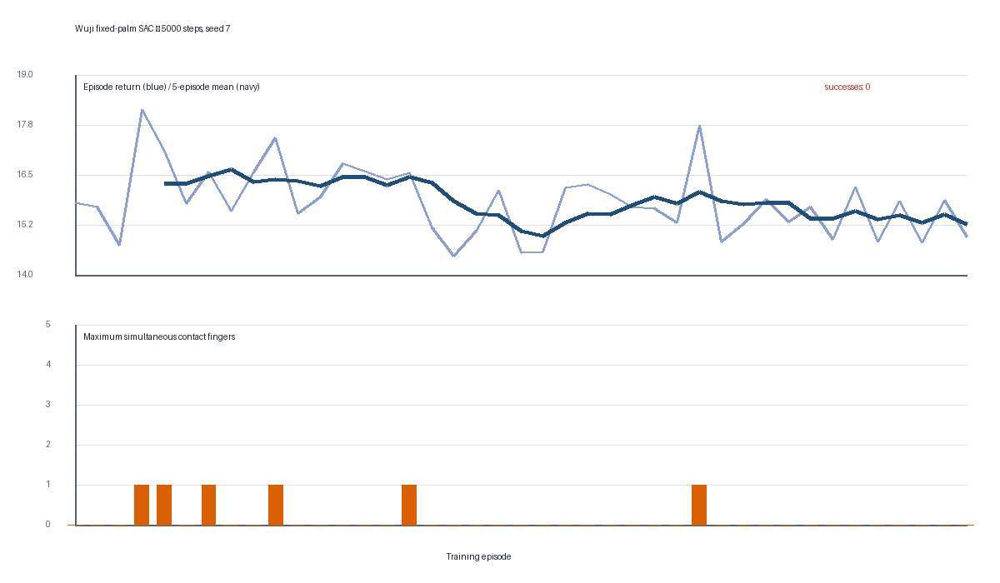

# Stage-1 RL: fixed-palm static grasp

## Scope and decision

This is the smallest RL experiment that addresses the current bottleneck: finding a
useful whole-hand contact configuration without prescribing a thumb/finger face
topology. It uses Stable-Baselines3 SAC with an MLP and privileged MuJoCo state.

Included now:

- deterministic seeded reset to a reachable, open-hand pregrasp;
- a numerically fixed 7-DoF arm/palm;
- independent delta-position targets for all 20 Wuji joints;
- fixed-size normalized proprioception, object state, geometry, and contact features;
- dense reward terms and a sustained static-grasp success gate.

Deliberately deferred: RGB/CNN, Transformer/VLA, ACT training, Lift, torque actions,
domain randomization, force-closure QP, curriculum stages 2/3, and long training.

Implementation: `src/openarm_wuji/rl/grasp_env.py`. Configuration:
`configs/rl/grasp_stage1.json`.

## Action contract: 20 dimensions

At control step `t`, the policy returns `a_t in [-1, 1]^20`. The environment first
limits the change from the previous policy action, then applies exponential smoothing:

```text
a_rate = a_(t-1) + clip(a_t - a_(t-1), -0.35, 0.35)
a_filter = 0.65 a_rate + 0.35 a_filter_previous
q_target = clip(q_current + 0.035 rad * a_filter, q_lower, q_upper)
```

The model's joint range and actuator control range are intersected for the final clip.
This is position control, not torque control. Indices are ordered exactly as the Wuji
synergy configuration names the joints:

| Action indices | Actuators |
|---|---|
| 0–3 | `wuji_left_finger1_joint1..4_actuator` (thumb) |
| 4–7 | `wuji_left_finger2_joint1..4_actuator` |
| 8–11 | `wuji_left_finger3_joint1..4_actuator` |
| 12–15 | `wuji_left_finger4_joint1..4_actuator` |
| 16–19 | `wuji_left_finger5_joint1..4_actuator` |

The old three-dimensional `open_close/pinch/spread` synergy is not in the RL action.

## Observation contract: 228 dimensions

Every item is finite, clipped to `[-1, 1]`, and `float32`. Positions and velocities use
the scales in the JSON config. Unit quaternions use scalar-first `wxyz` order and are
canonicalized to non-negative `w`.

| Slice | Size | Contents |
|---|---:|---|
| 0:20 | 20 | normalized hand `qpos` |
| 20:40 | 20 | hand `qvel / 5 rad/s` |
| 40:60 | 20 | normalized actuator targets |
| 60:80 | 20 | previous policy action |
| 80:93 | 13 | palm world position, quaternion, linear and angular velocity |
| 93:106 | 13 | cube world position, quaternion, linear and angular velocity |
| 106:113 | 7 | complete cube-in-palm SE(3) pose |
| 113:173 | 60 | for each finger: tip and distal-pad position relative to cube and palm |
| 173:228 | 55 | 11 aggregated contact features for each of five fingers |

Each per-finger contact block is:

```text
[has_contact, clipped_contact_count,
 force-weighted_normal_in_cube_xyz,
 summed_normal_force, summed_tangential_force,
 max_relative_contact_point_speed,
 strongest_contact_role_one_hot(tip, distal_pad, other_link)]
```

Reasonable distal-pad and other finger-link contacts are represented rather than
discarded. RGB, timestamps, recorder telemetry, labels, and success flags are not in
the policy observation.

## Reset and dynamics

1. Reuse `ReachGraspLiftTask.reset(seed)` for the same cube distribution and clean
   MuJoCo state.
2. Reuse its calibrated 6D palm IK to solve the existing grasp target while the hand is
   open.
3. Place the arm at that deterministic pregrasp, zero velocities, and settle 20 physics
   steps. Reject reset if this moves the cube by more than 20 mm.
4. Save the seven arm positions. Before every 2 ms physics step, restore those positions
   and zero their velocities; only the 20 hand actuators remain controllable.

The controller runs at 30 Hz. An episode is at most 120 control steps (4 s).

## Reward V2

The scalar reward is the sum below. Every component is also returned in
`info["reward_terms"]`.

```text
r = 2.00 r_approach_progress
  + 1.00 r_contact_transition
  + 0.10 r_contact_maintain
  + 0.50 beta r_stability
  + 0.50 beta r_hold
  - 0.20 beta p_slip
  - 2.00 p_penetration
  - 1.00 p_cube_motion
  - 0.01 mean(a_t^2)
  - 0.02 mean((a_t-a_(t-1))^2)
  + 10.0 I(success)
```

Definitions:

- `phi_coverage = 0.3 mean_i(phi_i) + 0.7 phi_third`, where
  `phi_i = exp(-max(d_i, 0)/0.025)` and `phi_third` uses the third-closest finger.
- `r_approach_progress = phi_coverage_t - phi_coverage_(t-1)`. Absolute proximity
  is diagnostic only and no longer earns a persistent reward.
- `r_contact_transition = 0.25 max(N_t-N_prev, 0) + 0.5 I(cross 2 contacts)
  + 0.5 I(cross 3 contacts)`. There is no thumb-specific bonus.
- `r_contact_maintain = min(N_t/3, 1)`.
- After reaching two contacts, `beta` stays zero for 0.10 s and ramps to one over
  0.20 s. It gates stability, hold, and slip, but does not change the success gate.
- `r_stability = 0.5[exp(-(v_rel/0.04)^2) + exp(-(w_rel/0.70)^2)]`.
- `r_hold = 0.5[exp(-(translation/0.025)^2) + exp(-(rotation_rad/0.15)^2)]`.
- `p_slip = 0.5[(1-exp(-(v_rel/0.04)^2)) +
  (1-exp(-(w_rel/0.70)^2))]`, bounded to `[0, 1]`.
- `p_penetration = (max(0, penetration-0.001)/0.004)^2`. Normal solver contact is
  allowed; only deep penetration is strongly penalized and an 8 mm penetration ends
  the episode as an exploit.
- `p_cube_motion` grows after 15 mm displacement or 0.08 m/s cube speed.

All thresholds and weights are configuration, not hidden code constants.
The exact V1/V2 comparison and 5K outcome are in `docs/reward_v2_5k_report.md`.

## Success and termination

Training success is provisional and intentionally broader than the earlier rigid-lift
diagnostic. After first useful multi-contact, the environment requires:

- at least two fingers with at least 0.1 N normal force;
- a 0.25 s establishment grace period;
- 0.50 s continuously retained contact;
- relative linear speed at most 0.025 m/s and angular speed at most 20 deg/s throughout
  the window;
- within-window cube-in-palm drift at most 12 mm and 10 deg;
- total cube displacement from reset at most 50 mm.

Success terminates the episode. Non-finite simulation, penetration above 8 mm, cube
displacement above 120 mm, or a 30 mm drop terminates as failure. Reaching 120 steps
truncates the episode.

For comparison only, `rigid_success_diagnostic` additionally reports whether total
post-establishment drift stayed below the CD-WM external 8 mm / 6 deg baseline. It is
not the sole training success criterion and is not claimed to be calibrated for Wuji.

## First executable checks (seed 7, 2026-09-07)

The Gymnasium checker passed. Three 120-step uniform-random episodes all produced
finite observations and no invalid termination. Seeds 7/8/9 reached respectively
0/0/1 simultaneous contact fingers, with returns 15.780/15.912/19.991. That is a
pipeline smoke, not a grasp baseline.

A separate direction-only reachability probe sent a 20-D closing-direction vector from
seed 7. It reached all five contact groups at some point, with only 0.007 mm deepest
penetration, but ended with one contact and no success. This proves the reset is close
enough for the independent joints to reach the cube; it is not an expert trajectory and
is not used to initialize SAC.

A deliberately short 256-step SAC run on CPU completed:

| Item | Result |
|---|---:|
| replay samples | 256 |
| gradient updates | 156 |
| actor parameter L2 change | 1.0271 |
| first 50-step mean reward | 0.1078 |
| last 50-step mean reward | 0.1388 |
| max contact fingers | 0 |
| success events | 0 |

The non-zero actor update and improved dense shaping reward verify that data collection,
replay, backpropagation, and environment stepping are connected. They do not establish
that SAC has learned a grasp; 256 steps are far too few and no contact was reached.

Reproduce:

```powershell
./.venvs/lerobot-policy/Scripts/python.exe scripts/rl_grasp_smoke.py --episodes 3 --seed 7
./.venvs/lerobot-policy/Scripts/python.exe scripts/train_sac_grasp.py --timesteps 256 --seed 7
./.venvs/lerobot-policy/Scripts/python.exe -m unittest discover -s tests -p test_rl_grasp_env.py -v
```

The next experiment should be a modest multi-seed training run with reward/contact
curves, followed by a no-reward-contact audit. Do not add Lift or image policies until
static contact acquisition improves measurably over random actions.

## 5,000-step follow-up (seed 7, 2026-09-07)

The first 5,000-step run completed 41 full 120-step training episodes and 4,900 gradient
updates. It did **not** learn a grasp:

| Item | Result |
|---|---:|
| training episodes with any contact | 6 / 41 (14.6%) |
| maximum simultaneous training contacts | 1 |
| training success events | 0 |
| first / last 250-step mean reward | 0.1299 / 0.1268 |
| first / last 10-episode mean return | 16.34 / 15.42 |
| deterministic evaluation success, seeds 7–11 | 0 / 5 |
| deterministic evaluation contacts, seeds 7–11 | 0 for every seed |

The learned deterministic action is not a no-op: mean absolute action is about 0.134
and hand `qpos` moves about 1.5 rad in L2. However, it primarily moves the thumb from
roughly 50 mm to 4–7 mm from the cube while the other four fingers remain 33–40 mm
away. Its mean reward is therefore almost entirely the proximity term (about 0.137–
0.140 per step); multi-contact, stability, hold, slip, and cube-motion terms all remain
zero. The policy found a single-finger proximity local optimum.

This is evidence against simply running longer with the same reward. Before a longer
run, the next change should be limited to the early contact-acquisition learning signal:
make proximity reward progress-based or emphasize the worst/farthest fingers, and add a
small first-contact transition bonus. The existing success gate, Lift logic, telemetry,
and ACT interface should remain unchanged.



## Structured 5-D action ablation

Reward tuning stopped after Reward V2. The next controlled experiment changed only
the policy action representation from 20 independent joint deltas to five independent
per-finger scalars. Each scalar multiplies an L2-normalized, four-joint closing
direction extracted from the verified scripted `sign(close_pose - open_pose)` probe.
The per-finger vector scales preserve the old 0.035 rad full-close delta on every
active joint. Rate limiting, smoothing, joint clipping, 228-D observation, Reward V2,
reset, horizon, success criterion, and SAC hyperparameters remain unchanged.

The all-ones sanity probe reached five simultaneous contacts, while each one-hot
action wrote targets only for its assigned finger. However, a fresh seed-7 5K SAC run
still reached at most one simultaneous contact. It doubled episodes with any contact
from 10/41 to 20/41 relative to 20-D Reward V2, but produced zero multi-contact, hold,
or success episodes. The acceptance gate was not met, so there is no 10K extension.

The full comparison and next decision are in
`docs/structured_action_ablation_5k.md`.
